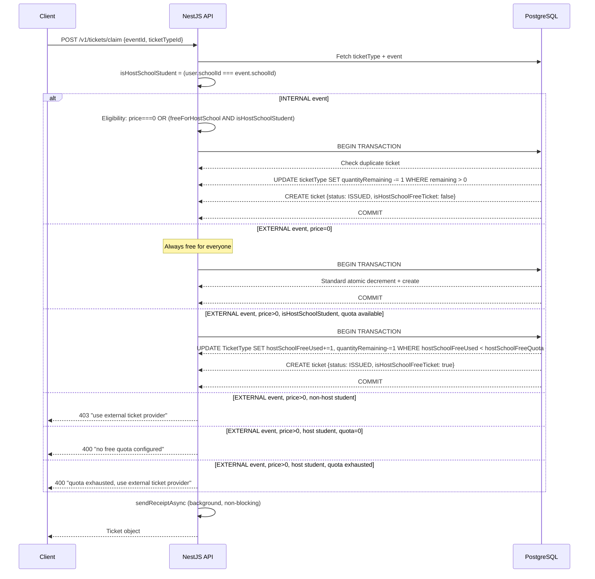
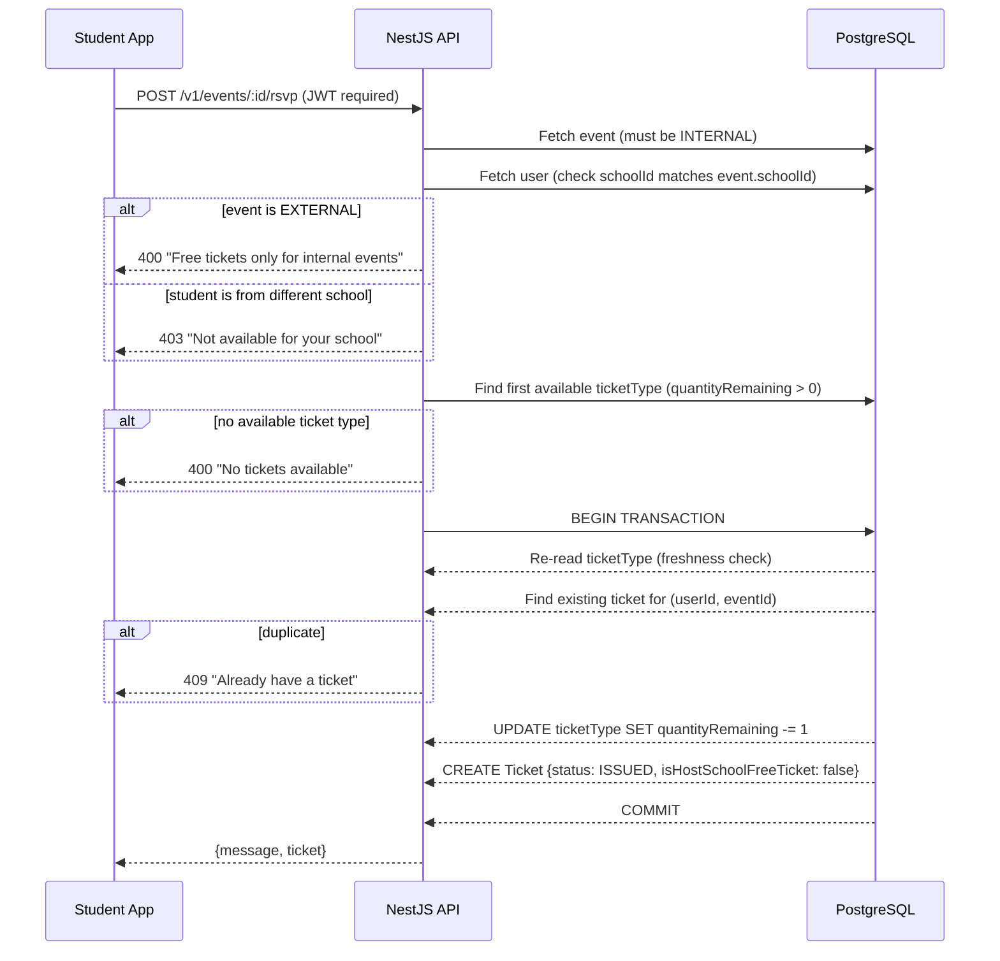
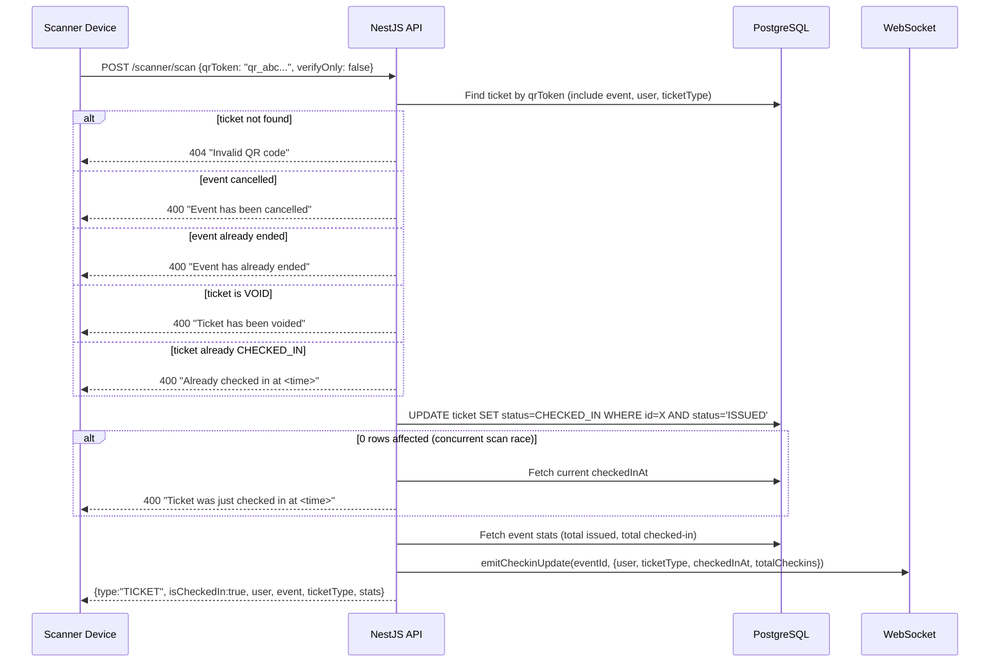

# TiKit — Project Context & Engineering Knowledge Base

> **Version:** 2026-06-08  
> **Audience:** Engineers, AI coding agents, new hires, maintainers  
> **Purpose:** Single source of truth for platform architecture, business rules, and implementation decisions.  
> A new engineer should be able to read this document and understand the entire platform without reading the codebase.

---

## Table of Contents

1. [Executive Summary](#1-executive-summary)
2. [Product Overview](#2-product-overview)
3. [System Architecture](#3-system-architecture)
4. [User Roles](#4-user-roles)
5. [Event System](#5-event-system)
6. [Ticketing System](#6-ticketing-system)
7. [RSVP Flow](#7-rsvp-flow)
8. [Host School Free Ticket Quota](#8-host-school-free-ticket-quota)
9. [External Ticket Purchase Flow](#9-external-ticket-purchase-flow)
10. [Scanner System](#10-scanner-system)
11. [Wallet System](#11-wallet-system)
12. [Database Design](#12-database-design)
13. [API Overview](#13-api-overview)
14. [Recent Architectural Changes](#14-recent-architectural-changes)
15. [Removed Features](#15-removed-features)
16. [AI Agent Instructions](#16-ai-agent-instructions)
17. [Deployment Notes](#17-deployment-notes)
18. [Future Roadmap](#18-future-roadmap)
19. [DO NOT CHANGE Without Business Approval](#19-do-not-change-without-business-approval)

---

## 1. Executive Summary

**TiKit** is a Swedish school event ticketing and membership platform built for student organisations. It enables schools to create events, issue free and quota-based tickets to students, manage membership cards, and validate attendance using QR codes.

### Who uses it

| User type | Description |
|---|---|
| **Students** | Browse events, claim tickets, manage wallet, scan QR at entry |
| **School admins** | Create events, manage ticket types, track attendance, issue cards |
| **Scanners** | Validate QR codes at event entrances in real time |
| **Super admins (TiKit staff)** | Cross-school oversight, platform configuration |

### Business purpose

TiKit replaces paper guest lists and manual ticket checks at school events. It provides:
- A digital wallet for students (tickets + membership cards)
- Capacity-controlled ticket issuance with race-condition protection
- QR-based entry validation with real-time check-in updates
- A host-school free quota system for external events
- Push/email/SMS campaigns tied to attendance segments

### Important payment model decision

**TiKit does not process any payments.** Paid tickets for external events are always purchased through an external provider URL (`externalBuyUrl`). TiKit only issues and tracks tickets that are free — including those from the host-school free quota on external events. This is a deliberate architectural decision. See [Section 9](#9-external-ticket-purchase-flow).

---

## 2. Product Overview

### Student App
Students register with a school code, verify their phone via OTP, and gain access to:
- Event feed (internal events from their school + all external events)
- RSVP / ticket claiming
- Digital wallet (tickets + activated membership cards)
- Social features: likes, comments, friends attending, follow system
- Push, email, and SMS notification preferences

### Admin App
School admins (KARORDFORANDE, EVENTANSVARIG) manage:
- Events: create, edit, publish, cancel, duplicate
- Ticket types: name, price, quantity, host-school free quota
- Attendee lists with search and check-in status
- Membership cards and code generation
- Campaign broadcasts (push / email / SMS) by audience segment
- Connection requests to other schools' external events

### Scanner
Dedicated scanner role (`SCANNER`) or any admin can:
- Scan any QR token via `POST /v1/scanner/scan`
- The same endpoint handles both event tickets (`qr_` prefix) and membership card codes
- See live attendance stats via WebSocket (`/ws` namespace)

### School Management
Each school has a unique `schoolCode` used during student registration. Schools can:
- Have internal events (visible only to own students)
- Host external events (visible to all students)
- Connect to other schools' external events
- Issue membership cards to their students
- Manage classes and student segments

### Notifications
- **Push:** Expo push notification service, queued via BullMQ
- **Email:** Resend transactional email provider
- **SMS:** 46elks / HelloSMS (configurable; `mock` provider available for dev)
- All notifications are non-blocking (fire-and-forget via queue or async)

---

## 3. System Architecture

### Backend Stack

| Layer | Technology |
|---|---|
| Framework | NestJS (Node.js, TypeScript) |
| ORM | Prisma v5 |
| Database | PostgreSQL (with PostGIS extension) |
| Auth | JWT RS256 (access + refresh token rotation) |
| Queue | BullMQ + Redis |
| WebSocket | Socket.IO (`/ws` namespace) |
| Storage | Cloudflare R2 (S3-compatible) — presigned URLs |
| Email | Resend |
| SMS | 46elks / HelloSMS (provider-switchable via `SMS_PROVIDER` env) |
| Push | Expo Server SDK |
| Logging | nestjs-pino (structured JSON in prod, pretty-print in dev) |
| Validation | class-validator + class-transformer (global `ValidationPipe`) |
| Rate limiting | @nestjs/throttler — 60 req/min global |
| API prefix | `/v1` (all routes) |
| Docs | Swagger at `/v1/docs` (disabled in production) |

### Database

PostgreSQL, managed via Prisma migrations. All migrations in `prisma/migrations/`. The schema file is the single source of truth at `prisma/schema.prisma`.

### Authentication

- RS256 asymmetric JWT (private key signs tokens, public key verifies)
- Access tokens: short-lived (default 15 min), configurable via `JWT_EXPIRATION`
- Refresh tokens: 30-day rolling window, stored as raw random bytes in the DB
- Refresh token rotation: old token is revoked on every refresh
- Password reset tokens: stored as SHA-256 hash (raw token only in email link)
- Account lockout: 5 failed logins → 15-minute lockout
- OTP verification: 5-digit code via SMS, 10-min expiry, max 5 attempts, 60-sec re-send cooldown

### Architecture Diagram

```
┌──────────────────────────────────────────────────────┐
│                   Client Apps                        │
│   Student App  │  Admin App  │  Scanner App          │
└──────┬─────────────────┬──────────────┬──────────────┘
       │ HTTPS REST       │              │ WebSocket /ws
       ▼                  ▼              ▼
┌──────────────────────────────────────────────────────┐
│              NestJS API  (v1/*)                       │
│  JwtAuthGuard → RolesGuard → ThrottlerGuard (global) │
│                                                       │
│  Auth  Events  Tickets  Scanner  Wallet  Cards        │
│  Users  Schools  Posts  Campaigns  Notifications      │
└──────┬──────────────────┬────────────────────────────┘
       │ Prisma Client     │ BullMQ Jobs
       ▼                   ▼
┌────────────┐     ┌──────────────┐
│ PostgreSQL │     │    Redis     │
│  (Prisma)  │     │  (BullMQ)   │
└────────────┘     └──────────────┘
       │
       ▼
┌─────────────────────┐
│  Cloudflare R2      │  (media/file storage, presigned URLs)
└─────────────────────┘
```

### Global Guards (applied to every route)

```
ThrottlerGuard   → enforces 60 req/min
JwtAuthGuard     → validates Bearer JWT (routes marked @Public() are exempt)
RolesGuard       → enforces @Roles(...) decorator
```

---

## 4. User Roles

Roles are stored as strings on `User.role`. Defined in `src/prisma-enums.ts`.

### STUDENT
- Registers with a `schoolCode`
- Can view events (own school's internal + all external)
- Can RSVP to internal events
- Can claim free tickets (internal events and external event host-school quota)
- Can view and use their wallet (tickets + cards)
- Cannot access admin, scanner, or campaign endpoints

### KARORDFORANDE (School President / KO)
- Full admin access scoped to their own school
- Create, edit, publish, cancel, and delete events
- Manage ticket types (including host-school free quota)
- View and manage attendee lists
- Issue and manage membership cards
- Request connections to other schools' external events
- Cannot act on behalf of other schools

### EVENTANSVARIG (Event Manager)
- Same permissions as KARORDFORANDE for event and ticket management
- Scoped to their own school
- Cannot delete events (DELETE is KO + TIKIT_ADMIN only)

### SCANNER
- Can call `POST /v1/scanner/scan` to validate QR codes
- Can call `GET /v1/scanner/events/:id/stats`
- Cannot access any management endpoints
- Joins WebSocket event rooms to receive real-time check-in updates

### TIKIT_ADMIN (Super Admin)
- No `schoolId` — operates across all schools
- Full access to all endpoints
- Bypasses school ownership checks (designed for internal staff/operations)
- Can modify any event, ticket type, school, or user

---

## 5. Event System

### Internal Events

**Definition:** Events created by a school, visible **only to students of that school**.

**Rules:**
- `eventType = 'INTERNAL'`
- All ticket types are forced to `price = 0`, `freeForHostSchool = true`, `hostSchoolFreeQuota = 0`
- These overrides are enforced in code — the admin cannot set a price on an internal event ticket type
- Students from other schools cannot see or access internal events
- RSVP is the only way to get a ticket; no external purchase flow

**Lifecycle:**
```
draft → (publish) → published → (cancel) → cancelled
                              → (unpublish) → draft
```

### External Events

**Definition:** Events visible to all students across all schools.

**Rules:**
- `eventType = 'EXTERNAL'`
- Ticket types can have a price (`price > 0`)
- Admins can configure `hostSchoolFreeQuota` on each ticket type
- Host-school students may claim free tickets from the quota
- All paid ticket purchases happen through `externalBuyUrl` (outside TiKit)
- Can be connected to other schools (multi-school events)

**Lifecycle:**
```
draft → (publish) → published → (cancel) → cancelled
                              → (unpublish) → draft
```

**Event Connection (Multi-School):**
External events support connection requests so students from other schools can be made aware of or associated with an event. Flow: `requestConnection` → `respondToConnectionRequest` (approved/rejected).

### Event Duplication

`POST /v1/events/:id/duplicate` creates a copy of the event:
- Status reset to `draft`, `isPublished = false`
- All ticket types copied with `quantityRemaining = quantityTotal` (reset to full capacity)
- `hostSchoolFreeUsed` reset to 0 on every duplicated ticket type
- Internal event rules re-applied on the duplicate

---

## 6. Ticketing System

### Ticket Lifecycle

```
[Ticket Created]
      │
      ▼
   ISSUED  ←──────────────────────────────┐
      │                                   │ (void/cancel restores capacity)
      ├── claimFreeTicket ────────────────┘
      │
      ▼
 CHECKED_IN  (terminal — capacity NOT restored on void)
      │
      ▼
   [VOID]   (admin action — or student cancel before check-in)
```

### Ticket Statuses

| Status | Meaning |
|---|---|
| `ISSUED` | Valid, not yet used at entry |
| `CHECKED_IN` | Used at event entry (terminal state) |
| `VOID` | Cancelled or invalidated |

### QR Token Generation

Every ticket gets two identifiers at creation:

| Field | Format | Purpose |
|---|---|---|
| `code` | 12-char hex uppercase | Human-readable short code (for staff lookup) |
| `qrToken` | `qr_` + 32-char hex | Machine-readable QR payload scanned at entry |

The `qr_` prefix is critical. The scanner uses it to distinguish event tickets from membership card codes (which have no prefix). **Never remove this prefix convention.**

```typescript
// src/tickets/tickets.service.ts
generateQrToken()  →  "qr_a3f9d2c1..."  (ticket)
// CardCode.code   →  "A3F9D2C1"        (membership card — no prefix)
```

### Free Ticket Claim Flow

`POST /v1/tickets/claim`



### Inventory Tracking — Race Condition Safety

All inventory decrements use `updateMany` with a `WHERE` clause that includes the availability condition. PostgreSQL evaluates the `WHERE` and applies the `SET` atomically, so concurrent requests cannot both pass the check:

```sql
-- Standard free claim (internal events)
UPDATE "TicketType"
SET "quantityRemaining" = "quantityRemaining" - 1
WHERE id = $1
  AND "quantityRemaining" > 0
  AND "isSoldOut" = false

-- Host-school quota claim (external events)
UPDATE "TicketType"
SET "hostSchoolFreeUsed" = "hostSchoolFreeUsed" + 1,
    "quantityRemaining"  = "quantityRemaining"  - 1
WHERE id = $1
  AND "hostSchoolFreeUsed" < "hostSchoolFreeQuota"
  AND "quantityRemaining"  > 0
```

If `affected rows = 0`, the claim is rejected immediately. No SELECT-then-UPDATE — this pattern is fundamental and must not be changed.

### Void and Cancel

| Operation | Who | Capacity restored? | hostSchoolFreeUsed restored? |
|---|---|---|---|
| `PATCH /v1/tickets/:id/void` | Admin | Yes (unless CHECKED_IN) | Yes, if `isHostSchoolFreeTicket=true` |
| Student cancel (via RSVP cancel) | Student | Yes | N/A (internal only) |
| `cancelTicket` (service method) | Internal | Yes | Yes, if `isHostSchoolFreeTicket=true` |

**CHECKED_IN tickets never restore capacity.** A used ticket is consumed.

### isSoldOut Flag

When a ticket claim or cancellation causes `quantityRemaining` to hit 0, `isSoldOut` is set to `true`. On void/cancel, it is reset to `false`. This flag provides a fast availability check without counting.

---

## 7. RSVP Flow

RSVP is **only for Internal Events**. It is the "I'm Going" button in the student app.

`POST /v1/events/:id/rsvp` → calls `fetchFreeTicket` internally.



### Cancel RSVP

`DELETE /v1/events/:id/rsvp`

- Finds the ticket for `(userId, eventId)`
- Rejects if `status = CHECKED_IN`
- Sets `status = VOID`, restores `quantityRemaining += 1`, clears `isSoldOut`
- **Does NOT touch `hostSchoolFreeUsed`** — internal events never use this counter

### Edge Cases

| Case | Behaviour |
|---|---|
| Student RSVPs twice | `ConflictException` — DB `@@unique([userId, eventId])` is the final guard |
| Race: two students claim last ticket | Only one `updateMany` succeeds (affected=1); the other gets `BadRequestException` |
| Event cancelled before RSVP | RSVP proceeds — cancellation is a display state, not a DB lock |
| CHECKED_IN ticket cancel attempt | `BadRequestException` — cannot cancel a used ticket |

---

## 8. Host School Free Ticket Quota

### Why this exists

External events are public (visible to all schools) but the hosting school may want to reserve free tickets for their own students — as a benefit of being part of the organising school. Paying students from other schools use the external ticket provider instead.

### The three new fields

#### On `TicketType`

| Field | Type | Default | Description |
|---|---|---|---|
| `hostSchoolFreeQuota` | `Int` | `0` | Total free slots reserved for host-school students on this ticket type |
| `hostSchoolFreeUsed` | `Int` | `0` | How many of those slots have been consumed (issued as free tickets) |

#### On `Ticket`

| Field | Type | Default | Description |
|---|---|---|---|
| `isHostSchoolFreeTicket` | `Boolean` | `false` | `true` only when the ticket was issued from the host-school free quota on an external event |

**Why `isHostSchoolFreeTicket` is needed:** When a ticket is voided or cancelled, we must know whether it came from the free quota. If it did, `hostSchoolFreeUsed` must be decremented so that slot can be claimed again. Without this flag, we cannot reliably identify quota-issued tickets after the fact.

### How quota is consumed

```
Preconditions:
  - event.eventType = 'EXTERNAL'
  - ticketType.price > 0
  - ticketType.hostSchoolFreeQuota > 0
  - user.schoolId === event.schoolId  (user IS from the host school)

Atomic SQL:
  UPDATE "TicketType"
  SET "hostSchoolFreeUsed" = "hostSchoolFreeUsed" + 1,
      "quantityRemaining"  = "quantityRemaining"  - 1
  WHERE id = <ticketTypeId>
    AND "hostSchoolFreeUsed" < "hostSchoolFreeQuota"
    AND "quantityRemaining"  > 0

If affected = 0 → quota exhausted or no tickets remaining → error
```

### How quota is released (on void or cancel)

```
If ticket.isHostSchoolFreeTicket = true AND ticket.status ≠ CHECKED_IN:

  UPDATE "TicketType"
  SET "hostSchoolFreeUsed" = GREATEST(0, "hostSchoolFreeUsed" - 1),
      "quantityRemaining"  = "quantityRemaining" + 1,
      "isSoldOut"          = false
  WHERE id = <ticketTypeId>

If ticket.isHostSchoolFreeTicket = false:
  Standard quantityRemaining restore only
```

### Example: Standard Ticket

```
Ticket Type: Standard
  price               = 300
  quantityTotal       = 100
  quantityRemaining   = 100  (initially)
  hostSchoolFreeQuota = 40
  hostSchoolFreeUsed  = 0    (initially)

After host-school student claims free:
  quantityRemaining   = 99
  hostSchoolFreeUsed  = 1

After all 40 free quota used:
  quantityRemaining   = 60
  hostSchoolFreeUsed  = 40
  → Further free claims rejected: "quota exhausted, use external provider"

After one free ticket is voided:
  quantityRemaining   = 61
  hostSchoolFreeUsed  = 39
  → Slot is available again for another host-school student
```

### Admin behaviour

When creating or updating a ticket type for an external event:
- `hostSchoolFreeQuota` must be `<= quantityTotal` (validated in service)
- Reducing `hostSchoolFreeQuota` below `hostSchoolFreeUsed` is rejected (cannot un-issue already-issued free tickets)
- For **internal** events, `hostSchoolFreeQuota` is always forced to `0` — the quota system does not apply; internal events use the `freeForHostSchool` flag instead

### Eligibility matrix

| Event type | Student school | ticket.price | hostSchoolFreeQuota | Outcome |
|---|---|---|---|---|
| INTERNAL | Host school | 0 | 0 | ✅ Free (standard path) |
| INTERNAL | Other school | 0 | 0 | ❌ Forbidden (visibility check) |
| EXTERNAL | Host school | > 0 | > 0, available | ✅ Free from quota |
| EXTERNAL | Host school | > 0 | > 0, exhausted | ❌ Use external provider |
| EXTERNAL | Host school | > 0 | 0 | ❌ Use external provider |
| EXTERNAL | Other school | > 0 | any | ❌ Use external provider |
| EXTERNAL | Any | 0 | any | ✅ Free (price=0, no quota) |

---

## 9. External Ticket Purchase Flow

### Why TiKit does not process payments

TiKit is a school event platform, not a payment processor. Integrating a payment gateway (Stripe, Klarna, etc.) introduces PCI DSS compliance obligations, legal responsibility for refunds and disputes, and significant implementation complexity. The decision was made to keep TiKit's responsibility boundary at **ticket issuance and validation** only. Payment for external events happens entirely outside TiKit through the event's own ticket provider.

### How `externalBuyUrl` works

Every external event has an optional `externalBuyUrl` field. When a student from another school (or a host-school student whose free quota is exhausted) tries to claim a TiKit ticket, the API returns an error. The client app is responsible for redirecting the user to `externalBuyUrl`.

**To get the external URL:**
```
GET /v1/events/:id/external-link
```
Returns:
```json
{
  "externalBuyUrl": "https://ticketmaster.se/event/xyz",
  "externalTicketStatus": "IN_STOCK"
}
```

`externalTicketStatus` is a free-text field managed by admins (e.g., `IN_STOCK`, `SOLD_OUT`, `FEW_LEFT`).

### User journey for a non-host student at an external event

```
Student views external event
         │
         ▼
   "Buy Ticket" button in app
         │
         ▼
   App calls GET /v1/events/:id/external-link
         │
         ▼
   App redirects student to externalBuyUrl
         │
         ▼
   Student buys ticket on external provider
         │
         ▼
   (No TiKit ticket is created — entry is managed by external provider)
```

### What TiKit never does for paid external tickets

- ❌ Creates a `Ticket` record for paid purchases
- ❌ Processes card charges
- ❌ Issues QR codes for paid external purchases
- ❌ Tracks paid external attendees in its scanner/wallet

---

## 10. Scanner System

### Endpoints

| Endpoint | Auth | Description |
|---|---|---|
| `POST /v1/scanner/scan` | SCANNER, EVENTANSVARIG, KARORDFORANDE, TIKIT_ADMIN | Scan a QR token (ticket or card) |
| `GET /v1/scanner/events/:id/stats` | Same roles | Get live attendance stats |

### QR type detection

The scanner uses the token prefix to decide what to scan:

```typescript
if (qrToken.startsWith('qr_')) → scanTicket()
else                           → scanCard()
```

### Ticket scan flow



### verifyOnly mode

When `verifyOnly: true`, the scanner validates the ticket without changing its status. Useful for queue management or pre-checks. An already-checked-in ticket returns an error even in verify-only mode.

### Race condition protection on concurrent scans

The check-in uses `updateMany` with `WHERE status = 'ISSUED'`. If two scanner devices scan the same QR simultaneously:
- The first request: `affected = 1` → success
- The second request: `affected = 0` → immediate error with the actual check-in time

### Card scan flow

For membership cards (no `qr_` prefix):
1. Finds `CardCode` by code
2. Checks card `status` is not `blocked` or `paused`
3. Checks card is not expired (`validUntil`)
4. Returns card info, benefits, activation status — **no state change** (card scanning is read-only)

### Event stats (`getEventStats`)

Returns:
```json
{
  "scannedCount": 45,
  "remainingEntries": 55,
  "totalCapacity": 100,
  "occupancyRate": 45
}
```
`totalCapacity` = all non-VOID tickets; `scannedCount` = CHECKED_IN tickets.

### WebSocket real-time updates

After each successful check-in, `emitCheckinUpdate` is called on the WebSocket gateway. All clients subscribed to `event:<eventId>` receive:
```json
{
  "userId": "...",
  "userName": "...",
  "ticketType": "Standard",
  "checkedInAt": "2026-06-08T19:45:00Z",
  "totalCheckins": 46
}
```

Clients join an event room by emitting `join_event` with `{ event_id }`. Students must have a valid (non-VOID) ticket to join. Scanner/admin roles can join any room freely.

---

## 11. Wallet System

`GET /v1/wallet` — returns the authenticated student's full wallet.

### Ticket Wallet

All tickets for the user, with full event context:
```json
{
  "id": "...",
  "code": "A3F9D2",
  "qrToken": "qr_abc...",
  "status": "ISSUED",
  "checkedInAt": null,
  "ticketTypeName": "General Admission",
  "ticketTypeDescription": "...",
  "event": { "title": "...", "startsAt": "...", "venueName": "..." },
  "isExpired": false
}
```

`isExpired = event.endsAt < now` — computed at query time for display purposes.

### Membership Cards

All activated card codes for the user:
```json
{
  "id": "...",
  "code": "AB12CD34",
  "activatedAt": "...",
  "title": "Student Union Card 2025",
  "benefits": ["10% off events", "Free coffee"],
  "validFrom": "...",
  "validUntil": "...",
  "school": { "name": "...", "logoUrl": "..." },
  "isExpired": false
}
```

`isExpired = validUntil < now OR card.status === 'blocked'`

### Card Activation

`POST /v1/wallet/activate` — takes a card code string, activates it atomically via a transaction (prevents double-activation race). Cards are school-scoped: students can only activate cards belonging to their own school.

### QR Storage

The wallet returns `qrToken` for each ticket. The mobile app is responsible for rendering this as a QR code for display. The token is opaque (prefixed hex string) — the app should never parse or mutate it.

### Status Handling

Voided tickets appear in the wallet but display as `VOID`. Expired events show `isExpired: true`. The wallet never filters out historical tickets — it is a complete record.

---

## 12. Database Design

### Core models and relationships

```
School
  ├── users[]          (User.schoolId → School.id)
  ├── events[]         (Event.schoolId → School.id)
  ├── cards[]
  ├── posts[]
  └── classes[]

User
  ├── tickets[]        (Ticket.userId → User.id)
  ├── cardCodes[]      (CardCode.userId → User.id)
  ├── posts[]
  └── refreshTokens[]

Event
  ├── ticketTypes[]    (TicketType.eventId → Event.id, CASCADE delete)
  ├── tickets[]        (Ticket.eventId → Event.id, CASCADE delete)
  ├── connectedSchools (many-to-many via _EventConnectedSchools)
  └── connectionRequests[]

TicketType
  └── tickets[]        (Ticket.ticketTypeId → TicketType.id)

Ticket
  ├── user             (User)
  ├── event            (Event)
  └── ticketType       (TicketType)
```

### Business-critical fields explained

#### `TicketType`

| Field | Why it exists |
|---|---|
| `quantityTotal` | Total seats for this ticket type (informational + used to validate quota) |
| `quantityRemaining` | Live decrement counter — decremented atomically on issue, incremented on void/cancel |
| `isSoldOut` | Fast availability flag — set when `quantityRemaining = 0`, cleared on restore |
| `fewLeftThreshold` | Display hint — UI shows "few left" when `quantityRemaining ≤ threshold` |
| `price` | `0` = always free. `>0` = paid via external provider for external events |
| `freeForHostSchool` | Legacy flag used for **INTERNAL** events — all internal tickets have this `true` |
| `hostSchoolFreeQuota` | **New.** Reserved free slots for host-school students on external events |
| `hostSchoolFreeUsed` | **New.** Counter of consumed quota slots — must never exceed `hostSchoolFreeQuota` |

#### `Ticket`

| Field | Why it exists |
|---|---|
| `code` | Human-readable 12-char code for staff manual lookup |
| `qrToken` | `qr_`-prefixed token for machine QR scanning |
| `status` | `ISSUED` / `CHECKED_IN` / `VOID` |
| `checkedInAt` | Timestamp of check-in — returned to scanner |
| `isHostSchoolFreeTicket` | **New.** Flags quota-issued tickets so void/cancel restores `hostSchoolFreeUsed` |
| `@@unique([userId, eventId])` | Prevents one student from having multiple tickets to the same event |

#### `User`

| Field | Why it exists |
|---|---|
| `schoolId` | The school this student belongs to — critical for visibility and quota eligibility |
| `role` | Controls access to all endpoints via `RolesGuard` |
| `failedLoginCount` / `lockedUntil` | Brute-force protection |
| `otpCode` (hashed) | Phone verification — stored as bcrypt hash |
| `deletedAt` | Soft delete — users are never hard-deleted |
| `expoPushToken` | Expo push notification device token |

#### `Event`

| Field | Why it exists |
|---|---|
| `eventType` | `INTERNAL` or `EXTERNAL` — controls visibility and ticketing rules |
| `schoolId` | The hosting school — used for host-school quota eligibility checks |
| `externalBuyUrl` | URL for external ticket purchase redirect |
| `externalTicketStatus` | Display status admin manages manually |
| `isCancelled` | Scanner rejects all tickets for cancelled events |
| `deletedAt` | Soft delete |

### Database indexes

All FK columns are indexed. Additional indexes:
- `School`: `isActive`, `city`
- `User`: `schoolId`, `role`, `approvalStatus`, `deletedAt`
- `Event`: `schoolId`, `isPublished`, `startsAt`, `deletedAt`
- `TicketType`: `eventId`
- `Ticket`: `userId`, `eventId`, `status`

---

## 13. API Overview

All routes are prefixed with `/v1`. All routes require JWT Bearer authentication unless marked `@Public()`.

### Auth routes (`@Public()`)

| Method | Path | Description |
|---|---|---|
| POST | `/v1/auth/login` | Login → access + refresh tokens |
| POST | `/v1/auth/register` | Register with schoolCode |
| POST | `/v1/auth/refresh` | Rotate refresh token |
| POST | `/v1/auth/verify-school` | Validate a schoolCode before registration |
| POST | `/v1/auth/forgot-password` | Send password reset email |
| POST | `/v1/auth/reset-password` | Reset password with token |
| GET | `/v1/` | Health check (returns 200 OK) |

### Auth routes (authenticated)

| Method | Path | Description |
|---|---|---|
| POST | `/v1/auth/logout` | Revoke refresh token |
| GET | `/v1/auth/me` | Get current user profile |
| POST | `/v1/auth/send-otp` | Request OTP for phone verification |
| POST | `/v1/auth/verify-otp` | Verify OTP → sets `isVerified=true` |

### Events

| Method | Path | Roles | Description |
|---|---|---|---|
| POST | `/v1/events` | KO, EA, ADMIN | Create event with ticket types |
| GET | `/v1/events` | All | List events (visibility filtered by role) |
| GET | `/v1/events/:id` | All | Event detail + stats + friends attending |
| PATCH | `/v1/events/:id` | KO, EA, ADMIN | Update event fields |
| DELETE | `/v1/events/:id` | KO, ADMIN | Delete event |
| POST | `/v1/events/:id/duplicate` | KO, EA, ADMIN | Duplicate event |
| PATCH | `/v1/events/:id/publish` | KO, EA, ADMIN | Publish event |
| PATCH | `/v1/events/:id/unpublish` | KO, EA, ADMIN | Unpublish event |
| PATCH | `/v1/events/:id/cancel` | KO, EA, ADMIN | Cancel event |
| PATCH | `/v1/events/:id/pin` | KO, ADMIN | Pin event |
| PATCH | `/v1/events/:id/unpin` | KO, ADMIN | Unpin event |
| GET | `/v1/events/:id/attendees` | KO, EA, ADMIN | Attendee list with search/filter |
| POST | `/v1/events/:id/ticket-types` | KO, EA, ADMIN | Add ticket type |
| PATCH | `/v1/events/:id/ticket-types/:ttId` | KO, EA, ADMIN | Update ticket type |
| DELETE | `/v1/events/:id/ticket-types/:ttId` | KO, EA, ADMIN | Delete ticket type |
| POST | `/v1/events/:id/rsvp` | All | RSVP (internal events only) |
| DELETE | `/v1/events/:id/rsvp` | All | Cancel RSVP |
| GET | `/v1/events/:id/external-link` | All | Get externalBuyUrl for external events |
| POST | `/v1/events/:id/like` | All | Toggle like |
| GET | `/v1/events/:id/comments` | All | Get comments |
| POST | `/v1/events/:id/comments` | All | Add comment |
| POST | `/v1/events/:id/connect` | KO, ADMIN | Request multi-school connection |
| GET | `/v1/events/:id/connections/requests` | KO, ADMIN | List connection requests |
| PATCH | `/v1/events/connections/requests/:id` | KO, ADMIN | Approve/reject connection request |

### Tickets

| Method | Path | Roles | Description |
|---|---|---|---|
| POST | `/v1/tickets/claim` | All | Claim a free ticket (internal + external quota) |
| GET | `/v1/tickets` | KO, EA, ADMIN | List tickets (admin) |
| GET | `/v1/tickets/:id` | All | Get ticket details |
| PATCH | `/v1/tickets/:id/void` | KO, EA, ADMIN | Void a ticket |
| PATCH | `/v1/tickets/:id/check-in` | SCANNER, KO, EA, ADMIN | Manual check-in |

### Scanner

| Method | Path | Roles | Description |
|---|---|---|---|
| POST | `/v1/scanner/scan` | SCANNER, KO, EA, ADMIN | Scan QR token (ticket or card) |
| GET | `/v1/scanner/events/:id/stats` | SCANNER, KO, EA, ADMIN | Live attendance stats |

### Wallet

| Method | Path | Roles | Description |
|---|---|---|---|
| GET | `/v1/wallet` | All | Get wallet (tickets + cards) |
| POST | `/v1/wallet/activate` | All | Activate a membership card code |

### Cards

| Method | Path | Roles | Description |
|---|---|---|---|
| POST | `/v1/cards` | KO, EA, ADMIN | Create card |
| GET | `/v1/cards` | KO, EA, ADMIN | List cards |
| GET | `/v1/cards/:id` | KO, EA, ADMIN | Card detail |
| PATCH | `/v1/cards/:id` | KO, EA, ADMIN | Update card |
| DELETE | `/v1/cards/:id` | KO, EA, ADMIN | Delete card |
| POST | `/v1/cards/:id/duplicate` | KO, EA, ADMIN | Duplicate card |
| POST | `/v1/cards/:id/generate-codes` | KO, EA, ADMIN | Bulk generate card codes |
| GET | `/v1/cards/:id/codes` | KO, EA, ADMIN | Export codes |
| GET | `/v1/cards/:id/activated-students` | KO, EA, ADMIN | Who activated this card |
| PATCH | `/v1/cards/:id/pause` | KO, EA, ADMIN | Pause card |
| PATCH | `/v1/cards/:id/block` | KO, EA, ADMIN | Block card |
| POST | `/v1/cards/claim` | STUDENT, KO, EA | Claim card by code |

### Vouchers

| Method | Path | Roles | Description |
|---|---|---|---|
| POST | `/v1/vouchers` | KO, EA, ADMIN | Create voucher |
| GET | `/v1/vouchers` | KO, EA, ADMIN | List vouchers |
| POST | `/v1/vouchers/redeem` | All | Redeem voucher code → creates ticket |

### Admin

| Method | Path | Roles | Description |
|---|---|---|---|
| GET | `/v1/admin/stats` | ADMIN | Platform-wide statistics |
| GET | `/v1/admin/queues` | ADMIN (middleware) | BullMQ queue dashboard |

---

## 14. Recent Architectural Changes

### Migration: `20260608000000_host_school_free_quota`

**File:** `prisma/migrations/20260608000000_host_school_free_quota/migration.sql`

**What changed:**

```sql
ALTER TABLE "TicketType" ADD COLUMN "hostSchoolFreeQuota" INTEGER NOT NULL DEFAULT 0;
ALTER TABLE "TicketType" ADD COLUMN "hostSchoolFreeUsed"  INTEGER NOT NULL DEFAULT 0;
ALTER TABLE "Ticket"     ADD COLUMN "isHostSchoolFreeTicket" BOOLEAN NOT NULL DEFAULT false;
```

**Why:** Prior to this migration, the system had `freeForHostSchool: Boolean` — a simple flag with no quota tracking. This was sufficient for internal events (where all tickets are free) but provided no mechanism for external events to reserve a limited number of free tickets for host-school students while selling the rest through an external provider.

**Impact on existing data:** Zero. All three columns default to `0`/`false`. Existing rows are unaffected.

**Impact on existing behaviour:** Internal event flow is completely unchanged. The new quota system is only activated when `event.eventType = 'EXTERNAL'` AND `ticketType.price > 0` AND `ticketType.hostSchoolFreeQuota > 0`.

### `freeForHostSchool` field — current role

This field still exists on `TicketType`. Its current role:
- **INTERNAL events:** Always `true` (enforced in code). Governs free eligibility for the existing `claimFreeTicket` path.
- **EXTERNAL events:** Not used for quota-based free tickets. The `hostSchoolFreeQuota > 0` condition governs eligibility instead.

Do not remove `freeForHostSchool` — it remains the gate for internal event free ticket logic.

### `POST /v1/tickets/purchase` — Never implemented

During development, a paid purchase endpoint was proposed and then immediately removed before being merged. It does not exist in the codebase and must not be added. See [Section 15](#15-removed-features).

---

## 15. Removed Features

### ~~`claimPaidTicket` service method~~

**Status:** Never shipped, removed during design.

**What it was:** A proposed `TicketsService.claimPaidTicket()` method that would have created TiKit tickets for paid purchases on external events, with a "paid pool reservation" check to prevent non-host students from consuming reserved free slots.

**Why it was removed:**
- TiKit does not process payments
- Paid ticket purchases for external events happen through `externalBuyUrl` entirely outside TiKit
- Creating a TiKit ticket record for paid purchases would imply TiKit manages the full purchase lifecycle, which it does not
- The reservation concept (paid pool vs free pool) was unnecessary because TiKit only manages the free quota portion

**What replaced it:** Nothing. Paid purchases are handled externally. The API correctly returns an error directing users to the external provider.

### ~~`POST /v1/tickets/purchase`~~

**Status:** Never shipped, removed during design.

**What it was:** A proposed endpoint for purchasing paid tickets through TiKit.

**Why it was removed:** Same reason as above. No payment gateway. All paid flows go through `externalBuyUrl`.

**Do not reintroduce this endpoint** without a full payment integration design review and business approval.

### ~~`freeForHostSchool` as the quota mechanism for external events~~

**Status:** Superseded for external events.

`freeForHostSchool = true` on an EXTERNAL ticket type with no `hostSchoolFreeQuota` configured no longer grants free access. The flag is only meaningful for INTERNAL events. This was intentional — external events require explicit quota configuration to prevent accidental unlimited free ticket issuance.

---

## 16. AI Agent Instructions

> **Read this section carefully before making any code changes.**

### Critical business rules

1. **TiKit never processes payments.** Do not add a payment gateway, Stripe integration, charge capture, or payment intent flow. Paid ticket purchases always go through `externalBuyUrl`.

2. **`POST /v1/tickets/purchase` must never be created.** This endpoint was explicitly removed. It must not be reintroduced.

3. **Internal events are always free.** Any code path that creates a ticket type for an INTERNAL event must force `price = 0`, `freeForHostSchool = true`, `hostSchoolFreeQuota = 0`. This is enforced in `events.service.ts` and must not be removed.

4. **Atomic inventory operations are mandatory.** Never use SELECT-then-UPDATE for inventory or quota changes. Always use `updateMany` with availability conditions in the `WHERE` clause, or raw SQL for column-comparison conditions. A race condition here issues more tickets than capacity.

5. **`isHostSchoolFreeTicket` must be set correctly.** Set `true` only when issuing from the external event quota path (`useQuotaPath = true`). Set `false` for all other ticket creation paths. Incorrect values cause incorrect `hostSchoolFreeUsed` restoration on void/cancel.

6. **`qr_` prefix on QR tokens is a protocol contract.** The scanner uses this prefix to distinguish tickets from card codes. Changing or removing this prefix breaks all scanners. The prefix is defined in `generateQrToken()` in `tickets.service.ts`.

7. **`@@unique([userId, eventId])` on Ticket is a hard business rule.** One ticket per person per event. Do not remove this constraint. The service has a duplicate check inside the transaction as an application-level guard, but the DB constraint is the final guarantee.

8. **`hostSchoolFreeQuota` must never exceed `quantityTotal`.** Validated in `events.service.ts` on create and update. Do not bypass this check.

9. **`hostSchoolFreeUsed` must never be reduced below 0.** The restoration SQL uses `GREATEST(0, hostSchoolFreeUsed - 1)` to prevent underflow. Maintain this guard.

10. **CHECKED_IN tickets never restore capacity.** An attendee who has entered the event has consumed their slot. Restoring capacity for a used ticket would over-count available seats.

### Things not to modify without approval

- The JWT RS256 key strategy — the key type and algorithm are a security boundary
- The refresh token rotation logic — revoking old tokens on refresh prevents token theft
- The `freeForHostSchool` internal event enforcement — removing it would allow paid internal events
- The `hostSchoolFreeUsed` / `hostSchoolFreeQuota` atomic SQL — changing to non-atomic patterns will cause double-claim bugs under load
- The `qr_` prefix on ticket QR tokens
- The DB unique constraint `@@unique([userId, eventId])` on `Ticket`

### Known architectural decisions

| Decision | Reason |
|---|---|
| No payment gateway | Keeps TiKit outside PCI-DSS scope; paid external tickets handled by specialist providers |
| RS256 JWT (asymmetric) | Public key can be shared with external services for token verification without exposing the private key |
| BullMQ for notifications | Decouples email/SMS/push from request latency; retry-safe with exponential backoff |
| Atomic SQL for quota | `updateMany WHERE` pattern is the only safe way to prevent overselling under concurrent load |
| `isHostSchoolFreeTicket` flag on Ticket | Allows correct `hostSchoolFreeUsed` restoration without additional DB lookups at cancel time |
| `qr_` prefix convention | Scanner needs to distinguish tickets from card codes in a single endpoint |
| Soft delete on User and Event | Preserves audit trail; deleted users still own historical ticket records |
| `GREATEST(0, ...)` in quota restore | Defensive guard — prevents counter underflow if voiding is called in an unexpected order |

### Areas requiring caution

- **Adding new ticket claim paths:** Any new path that creates a `Ticket` row must decide whether `isHostSchoolFreeTicket` should be `true` and whether quota counters need updating
- **Modifying `cancelTicket` or `voidTicket`:** Must preserve the split logic: quota-issued tickets restore `hostSchoolFreeUsed`; others do not
- **Changing event duplication:** Always reset `hostSchoolFreeUsed = 0` on duplicated ticket types — the copy starts with zero usage
- **Voucher redemption** (`vouchers.service.ts`): Currently does not touch `hostSchoolFreeUsed`. If vouchers are ever issued for external event quota tickets, this service needs updating

---

## 17. Deployment Notes

### Required environment variables

| Variable | Required | Description |
|---|---|---|
| `DATABASE_URL` | ✅ | PostgreSQL connection string (pooled, for runtime) |
| `DIRECT_URL` | ✅ | PostgreSQL direct connection (for migrations) |
| `JWT_PRIVATE_KEY` | ✅ | RS256 private key for token signing |
| `JWT_PUBLIC_KEY` | ✅ | RS256 public key for token verification |
| `JWT_EXPIRATION` | optional | Access token TTL (default `15m`) |
| `JWT_REFRESH_EXPIRATION_DAYS` | optional | Refresh token TTL in days (default `30`) |
| `REDIS_URL` | ✅ | Redis connection string (BullMQ backend) |
| `CORS_ORIGIN` | ✅ prod | Comma-separated allowed origins |
| `FRONTEND_URL` | ✅ prod | Base URL for password reset links |
| `RESEND_API_KEY` | optional | Resend email API key |
| `SMS_PROVIDER` | optional | `mock` or `hellosms` (default `mock`) |
| `R2_ENDPOINT` | optional | Cloudflare R2 endpoint for file uploads |
| `R2_ACCESS_KEY_ID` | optional | R2 access key |
| `R2_SECRET_ACCESS_KEY` | optional | R2 secret |
| `R2_BUCKET_NAME` | optional | R2 bucket (default `tikit-media`) |
| `R2_PUBLIC_URL` | optional | Public CDN URL for uploaded files |
| `EXPO_ACCESS_TOKEN` | optional | Expo push token for improved rate limits |
| `NODE_ENV` | optional | `development` / `production` / `test` |
| `PORT` | optional | HTTP port (default `3000`) |

### Migrations

```bash
# Apply pending migrations (production)
npx prisma migrate deploy

# Create a new migration during development
npx prisma migrate dev --name describe_your_change

# Regenerate Prisma client after schema changes
npx prisma generate
```

**Important:** The Prisma client must be regenerated (`prisma generate`) every time `schema.prisma` changes. TypeScript will fail to compile if the client is stale.

### Build and test

```bash
npm run build     # NestJS + SWC compile — 0 issues expected
npm test          # Jest unit tests (excludes *.integration.spec files)
npm run test:e2e  # End-to-end tests
```

Integration tests require `TEST_DATABASE_URL` pointing to a test database:
```bash
TEST_DATABASE_URL=postgresql://... npx jest free-host-school.integration
```

### Swagger docs

Available at `/v1/docs` in non-production environments. Disabled in production.

### BullMQ dashboard

Available at `/v1/admin/queues`. Protected by `BullBoardAuthMiddleware`. Requires admin authentication.

### Deployment platform

The backend references `tikit-backend.onrender.com` in startup logs, indicating Render.com as the current deployment target. The architecture is compatible with any Node.js hosting platform (Railway, Fly.io, etc.) that supports environment variables, a PostgreSQL database, and a Redis instance.

---

## 18. Future Roadmap

### Already Implemented

- JWT authentication with RS256, refresh token rotation, OTP phone verification
- Account lockout (brute-force protection), password reset via email
- Internal events (free tickets, host-school only visibility)
- External events with `externalBuyUrl` redirect
- Host-school free ticket quota for external events (`hostSchoolFreeQuota`, `hostSchoolFreeUsed`)
- QR-based ticket issuance with `qr_` prefix convention
- Atomic inventory management (race-condition safe)
- QR scanner with real-time WebSocket check-in updates
- Verify-only scan mode
- Digital wallet (tickets + membership cards)
- Membership card system with code generation and activation
- Voucher system (admin-issued codes → tickets)
- Social features (likes, comments, friends attending, follow system)
- School feed with posts, polls, and image support
- Push / email / SMS campaigns with audience segmentation
- Multi-school event connections
- BullMQ job queue for async notifications
- Cloudflare R2 file storage with presigned URLs
- Rate limiting (60 req/min global)
- Helmet security headers
- Structured JSON logging (pino)
- Health check endpoint
- Event duplication
- Class management
- Admin statistics dashboard

### Planned (not yet implemented)

- Payment gateway integration for direct ticket purchases (requires full PCI-DSS design review and business approval before starting)
- Admin approval workflow for student registrations (`approvalStatus` field exists but workflow is incomplete)
- Deep link support for mobile app routing (`deepLink` field exists on events and ticket types)
- Attendance exports (CSV/PDF)
- Post scheduling for school feed
- Full HelloSMS integration (currently mock in most deployments)

### Out of Scope

- `POST /v1/tickets/purchase` — explicitly removed, must not be reintroduced without business approval
- Processing refunds — TiKit does not hold funds; refunds are between student and external provider
- Custom payment forms — all payment UI belongs to the external provider

---

## 19. DO NOT CHANGE Without Business Approval

The following pieces of logic encode explicit business decisions. They must not be altered by any engineer or AI agent without written business/product approval, because changing them silently would alter the fundamental product contract with users:

### Payment boundary

> **TiKit does not process, collect, or hold any money.**

The decision to redirect all paid purchases to `externalBuyUrl` is intentional and permanent until the business explicitly decides to integrate a payment gateway. No payment-related code (Stripe, Klarna, Swish, etc.) should be added without a formal architecture review.

### Free quota enforcement for external events

```
hostSchoolFreeQuota must:
  - be >= 0
  - be <= quantityTotal
  - never be reduced below hostSchoolFreeUsed
```

These three rules protect existing ticket holders. Violating them could result in students having tickets that are no longer covered by quota accounting, causing incorrect availability calculations.

### Internal event pricing

```
INTERNAL event ticket types:
  price = 0 (always)
  freeForHostSchool = true (always)
  hostSchoolFreeQuota = 0 (always)
```

Internal events are a benefit of school membership. Making them paid breaks the promise to students and school admins.

### Ticket uniqueness per event

```
@@unique([userId, eventId]) on Ticket
```

One student, one ticket per event. Removing this constraint would allow duplicate tickets, break the scanner (which can check in each user only once), and enable capacity manipulation.

### `qr_` prefix on ticket QR tokens

```
generateQrToken() → "qr_" + 32 hex chars
```

The scanner differentiates tickets from membership cards purely by this prefix. Changing the prefix or removing it breaks every deployed scanner device without a coordinated client update.

### CHECKED_IN capacity

```
CHECKED_IN tickets NEVER restore capacity on void/cancel
```

A person who has entered the event has consumed their physical space. Restoring the capacity counter would allow the venue to be oversold after entry.

### Atomic inventory SQL

```sql
UPDATE "TicketType" SET quantityRemaining = quantityRemaining - 1
WHERE quantityRemaining > 0   -- availability checked atomically
```

This pattern prevents overselling under concurrent load. Non-atomic alternatives (SELECT + UPDATE in two round-trips) will cause double-booking at scale.

---

*End of PROJECT_CONTEXT.md*

*Maintained by the TiKit engineering team. Update this document whenever a business rule, architectural decision, or major feature changes.*
